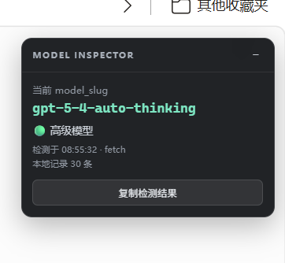
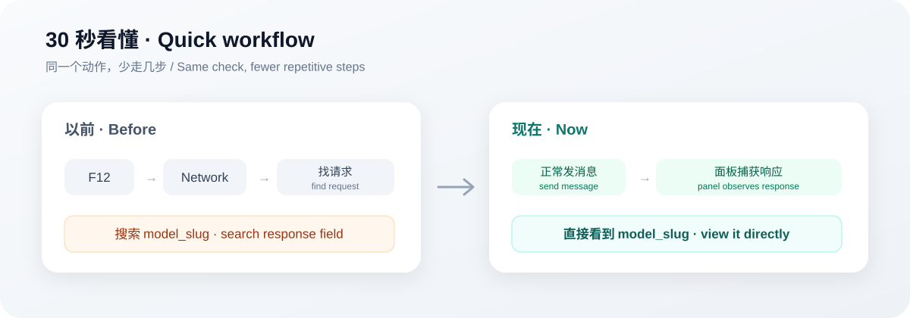

# ChatGPT Model Inspector

[简体中文](README.md) | **English**

> Turn the repeated `F12 → Network → find request → search model_slug` routine into a quick glance at the top-right corner of ChatGPT.

`v0.1.0` · `Edge / Chrome` · `Manifest V3`



## 30-second overview

Checking a `model_slug` manually usually means opening DevTools, finding the relevant network request, and searching through the response body.

With this extension, the flow is shorter: use ChatGPT normally, and when the page handles a response containing `model_slug`, the latest value is surfaced in a small panel.



For example, a response may contain a field like:

```json
{
  "model_slug": "gpt-example-model"
}
```

The panel shows the latest detected slug. Clicking **Copy detection result** produces output similar to:

```text
ChatGPT Model Inspector
model_slug: gpt-example-model
level: 🟡 标准模型
transport: fetch
url: https://chatgpt.com/backend-api/conversation
time: 2026-09-03T00:00:00.000Z
```

The slug above is intentionally generic and does not claim that a current real session returns that exact name.

## Why I made it

The idea is deliberately small: sometimes I want to see which `model_slug` is explicitly present in a ChatGPT page response.

Doing that manually works, but repeating **DevTools → Network → conversation / response → search field** is exactly the kind of tiny workflow friction that is easy to automate.

So this project turns that inspection step into a small browser panel. It does not decide what the result means for you; it just makes the raw field easier to see.

## What it can tell you

- When a page-handled response explicitly contains `model_slug`, the extension attempts to extract it.
- It shows the latest slug together with transport and detection time.
- It stores up to 30 recent non-rapid-duplicate detections in browser-local storage.
- If the slug contains a standalone `mini` segment, the UI shows a naming-based warning.

## What it cannot tell you

- It **cannot prove** the hidden internal capability configuration of a model.
- It **cannot explain** why a particular routing decision happened.
- The `mini` warning is **not a quality verdict**; it is only a convenience indicator based on the slug name.
- If no observable response contains `model_slug`, the extension does not guess from the visible ChatGPT model label.

The key boundary is simple: **this is a response-field inspector, not a model-authenticity detector.**

## Who it is for

- People who already open DevTools to inspect ChatGPT network responses.
- Developers or power users who want a faster way to record returned slugs across sessions.
- Anyone debugging browser behavior or routing observations and wanting fewer repetitive steps.

If you never inspect the Network panel, you probably do not need this extension.

## Install

The current build is an **unpacked developer-mode extension**. It is not yet distributed through Chrome Web Store or Edge Add-ons.

### Option 1: Download a Release archive

1. Download `chatgpt-model-inspector-v0.1.0.zip` from GitHub Releases.
2. Extract it to a stable folder.
3. Open `edge://extensions/` in Edge or `chrome://extensions/` in Chrome.
4. Enable **Developer mode**.
5. Click **Load unpacked**.
6. Select the extracted folder.
7. Refresh `https://chatgpt.com/` and send a new message.

### Option 2: Load directly from source

Clone or download this repository and select the repository root in the browser extension page. `manifest.json` should be directly visible in that folder.

> If ChatGPT was already open before the extension was installed or updated, refresh the tab so the network hook can install during page initialization.

## Usage

Once installed, use ChatGPT normally. There is no separate start button for the network listener.

When a supported response contains `model_slug`:

1. The top-right panel updates to the latest slug.
2. It shows the detection time and `fetch` / `XHR` transport.
3. You can copy the current result.
4. The panel can be collapsed when you do not need it.

To inspect locally stored history, switch DevTools Console to the extension content-script JavaScript context and run:

```js
chrome.storage.local.get("modelSlugHistory").then(console.log)
```

Stored records look like:

```json
{
  "modelSlug": "gpt-example-model",
  "transport": "fetch",
  "url": "https://chatgpt.com/backend-api/conversation",
  "detectedAt": "2026-09-03T00:00:00.000Z"
}
```

## Permissions and local data

The current `manifest.json` declares a small permission set:

- `storage` for recent detection history.
- `https://chatgpt.com/*`
- `https://chat.openai.com/*`

Detection history is stored in `chrome.storage.local`. The project currently does not configure a separate backend service. If browser-extension permissions matter to you, review `manifest.json`, `src/page-hook.js`, and `src/content.js` directly.

## How it works

The extension uses Manifest V3 content scripts in two worlds:

- `src/page-hook.js` runs in the page `MAIN` world and observes `fetch` / XHR responses related to conversation / response paths.
- `src/content.js` runs in the isolated extension world, validates page messages, renders the panel, and stores local history.
- `src/panel.css` styles the panel inside a Shadow DOM.

For `fetch`, the extension attempts to inspect a `Response.clone()` copy. For XHR, it mainly reads text through event listeners. The intended behavior is passive observation rather than rewriting request parameters, response bodies, or page callbacks.

## Limitations

- ChatGPT frontend routes and response structures may change, which can require updates here.
- The extension only reports `model_slug` when that field is observable in a page-handled response.
- The same slug may appear repeatedly in a response stream, so short rapid duplicates are filtered from local history.
- There is currently no browser-store distribution or automatic store update path.

## Development and tests

Run the local smoke test with:

```bash
node tests/page-hook.smoke.js
```

It checks:

- slug extraction from `fetch` responses;
- slug extraction from XHR responses;
- reading a cloned response does not consume the original `fetch` response received by the page.

Project structure:

```text
chatgpt-model-inspector/
├─ assets/
│  ├─ model-inspector.png
│  └─ workflow-example.svg
├─ docs/
│  ├─ VIBE_RELEASE_EXAMPLE.md
│  └─ VIBE_RELEASE_RULES.md
├─ manifest.json
├─ README.md
├─ README_EN.md
├─ src/
│  ├─ content.js
│  ├─ page-hook.js
│  └─ panel.css
└─ tests/
   └─ page-hook.smoke.js
```

## Version

Current public preview: **v0.1.0**.

The project follows a simple `0.x.y` versioning rule: small fixes increment patch, meaningful new features increment minor, and it stays in `0.x` until behavior and compatibility are mature enough.

## License

No open-source license has been selected yet. Until a license is added, do not assume this repository is licensed under MIT, Apache, or another open-source license.

---

If this tool saves you from opening DevTools a few times, it has done its job.
